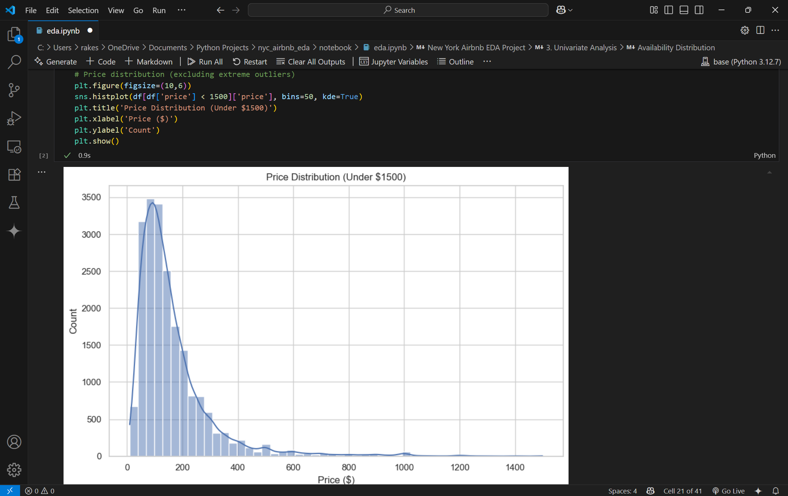
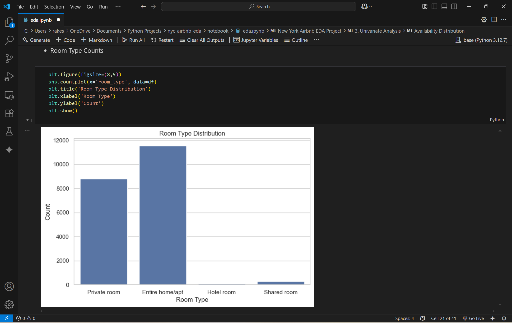
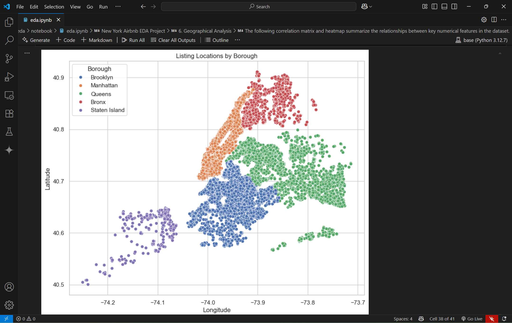
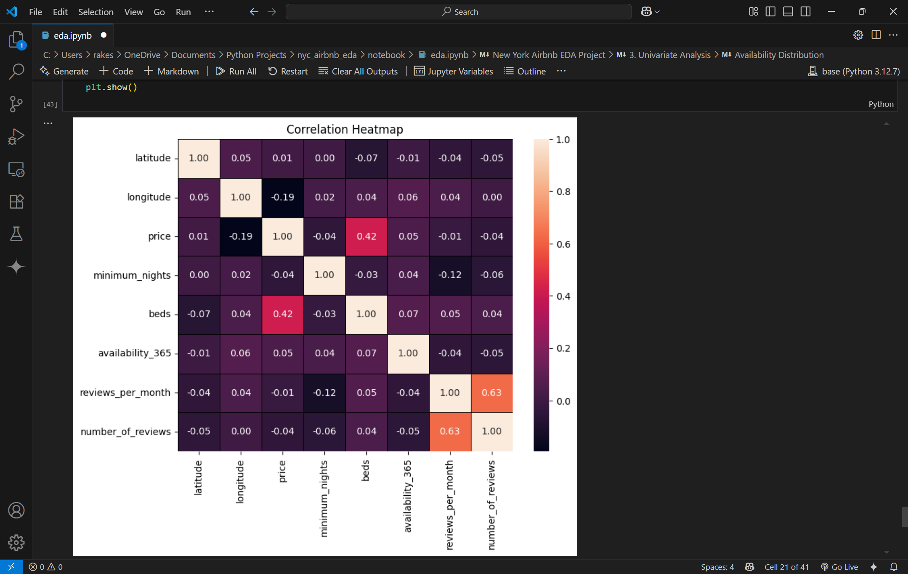

# New York Airbnb EDA Project

## Overview

This project provides an in-depth exploratory data analysis (EDA) of Airbnb listings in New York City using a 2024 dataset. The analysis aims to uncover trends in pricing, room types, availability, reviews, and spatial distribution across the city's boroughs. The findings can help hosts, guests, and researchers better understand the dynamics of the NYC short-term rental market.

## Objective

- Analyze the New York City Airbnb market and discover patterns in pricing, room types, availability, and guest reviews.
- Identify which factors most influence price and availability.
- Visualize the spatial distribution of listings and highlight borough-level differences.

## Dataset

- **File:** `new_york_listing_2024.csv`
- **Source:** Provided dataset (included in this repository)
- **Description:** The dataset contains detailed information on Airbnb listings across all NYC boroughs.  
**Key columns include:**
  - id, name: Unique identifier and name of the listing
  - host_id, host_name: Host identifiers and names
  - neighbourhood_group: Borough (e.g., Manhattan, Brooklyn)
  - neighbourhood: Specific neighborhood within the borough
  - latitude, longitude: Geographical coordinates
  - room_type: Type of room offered (Entire home/apt, Private room, Shared room, Hotel room)
  - price: Price per night in USD
  - minimum_nights: Minimum number of nights required to book
  - number_of_reviews, last_review, reviews_per_month: Review metrics
  - availability_365: Number of days available in the year
  - license: License status (e.g., No License, Exempt)
  - rating: Guest rating score
  - bedrooms, beds, baths: Accommodation details

## Installation

1. Clone the repository:
```
git clone https://github.com/rakeshjoshi4/nyc-airbnb-eda
cd nyc-airbnb-eda
```

2. Install dependencies:
```
pip install -r requirements.txt
```

## Usage

- Open `notebooks/eda.ipynb` in Jupyter Notebook or VS Code.
- Ensure `data/new_york_listing_2024.csv` is present.
- Run the notebook cells to reproduce the analysis and visualizations.

## Results Preview

Below are sample visualizations from the analysis, offering a quick look at the main patterns in the New York Airbnb dataset:

- **Price Distribution Histogram:**


- **Room Type Distribution Bar Plot:**


- **Geographical Scatter Plot of Listings:**  


- **Correlation Heatmap:**  


*These visuals highlight pricing trends, the diversity of listing types, spatial patterns across boroughs, and relationships between key features.*

## Summary of Key Findings

- **Manhattan** has the highest average listing price, while **Staten Island** has the lowest.
- **Private rooms** are most prevalent in Brooklyn and Queens, whereas **entire homes/apartments** dominate in Manhattan.
- Listings with more **bedrooms** and **beds** generally command higher prices.
- **Availability** is highest for listings in Queens and lowest in Manhattan.
- **High-priced listings** are geographically clustered in central Manhattan.
- **Outliers** exist in both price and availability, indicating some extreme or unique cases.
- **Many listings require a minimum stay of 30 nights**, but there is wide variability across boroughs and room types.
- The **number of reviews** is not strongly correlated with price, but some room types and neighborhoods tend to get more reviews.
- **Spatial analysis** shows dense clusters of listings in Manhattan and Brooklyn, with more affordable options in Queens and The Bronx.
- **Feature engineering** (price per bed) reveals that some neighborhoods offer better value than others.
- **Licensing status** varies, with many listings showing “No License” or “Exempt.”
- **Correlation matrix insights:**
- **Price** shows a moderate positive correlation with **number of bedrooms** and **number of beds**.
- **Availability_365** has a weak negative correlation with price.
- **Number of reviews** and **reviews per month** have low correlation with price.
- **Rating** is only weakly correlated with other features.

## Conclusion

This EDA provides a comprehensive look at the New York City Airbnb market, highlighting key trends in pricing, room types, availability, and guest engagement. The analysis reveals clear differences across boroughs and room types, and offers actionable insights for hosts, guests, and market researchers. The findings can inform pricing strategies, listing improvements, and further research into the dynamics of short-term rentals in NYC.

## License

This project is licensed under the MIT License. See the [LICENSE](LICENSE) file for details.

## Contact

For questions, feedback, or issues, please [open an issue](https://github.com/rakeshjoshi4/nyc-airbnb-eda/issues) or contact me directly.
